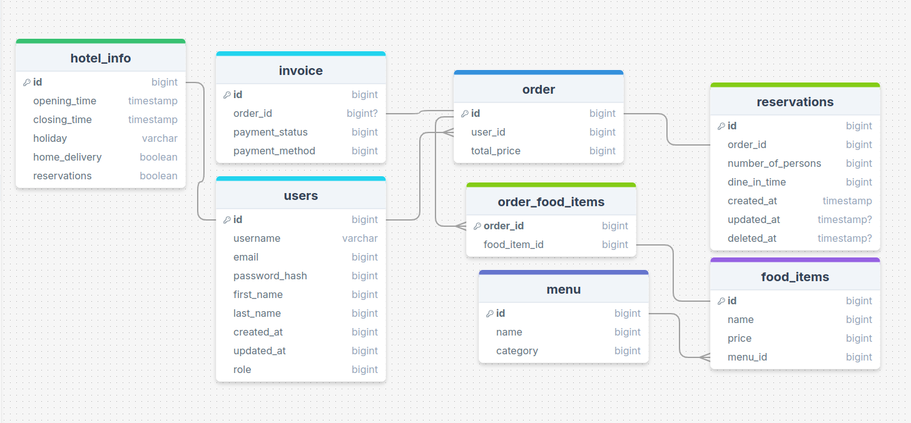

# **Hotel Management Backend**  
### **Optimized Backend Solution for Hotel Management**

This project is a robust, feature-rich backend application built with **Golang**, optimized for high performance and low latency. It integrates advanced tools and techniques to streamline hotel management operations, provide real-time insights, and enhance the overall user experience.

---

## **Features**
- **Admin Panel:**  
  - Real-time sales analysis and reporting.  
  - Role-based access control for admins and users.  
  - AI-driven recommendations based on past booking and sales data.  

- **Customer Support:**  
  - Integrated AI chat assistant for 24/7 customer support.  

- **Task Automation:**  
  - Cron jobs for routine task automation (e.g., scheduled report generation, periodic database cleanup).  

- **Booking and Room Management:**  
  - APIs to manage room availability, bookings, and cancellations.  

- **Email Notifications:**  
  - SMTP-based email functionality for order confirmations and notifications.  

- **Performance Optimization:**  
  - Leveraged Go routines for concurrent processing.  
  - Redis caching for frequently accessed resources.  

- **Database Management:**  
  - Complex PostgreSQL schema for detailed hotel data.  
  - Custom database migrator for smooth and efficient updates.  

---

## **Tech Stack**
- **Backend:** Golang  
- **Database:** PostgreSQL  
- **Caching:** Redis  
- **Deployment:** Docker, Kubernetes  
- **CI/CD:** GitHub Actions  

---

## **Schema Overview**

*(This image represents the PostgreSQL schema structure used for the project.)*

---

## **Installation and Usage**

### **1. Clone the Repository**
```bash
git clone https://github.com/your-username/hotel-management-backend.git
cd hotel-management-backend
```

### **2. Set Up Environment Variables**
Create a `.env` file and provide the necessary configurations:
```env
PORT=
DB_HOST=
DB_PORT=
DB_USER=
DB_NAME=
DB_PASSWORD=
ADMIN_DEFAULT_EMAIL=
ADMIN_DEFAULT_PASSWORD=
ADMIN_ROLE=
JWT_SECRET=
MAIL_HOST=
MAIL_PORT=
MAIL_USERNAME=
MAIL_PASSWORD=
OPENAI_KEY=
AWS_SECRET_ACCESS_KEY=
AWS_ACCESS_KEY=
REGION=
ECR_REPOSITORY=
ECS_CLUSTER=
ECS_SERVICE=
ECS_TASK_DEFINITION=
```

### **3. Run the Application**
#### Using Docker:
```Makefile
make docker-setup
```

#### Locally:
```Makefile
make local-setup
```

---

## **Deployment**

### **CI/CD Pipeline**
- Integrated **GitHub Actions** for automated build, and deployment workflows.

### **Kubernetes Deployment**
- The application is containerized with **Docker** and deployed on a **Kubernetes** cluster for scalability and reliability.

---

## **Project Highlights**
- **Duration:** 3 months (completed alongside full-time employment).  
- Built to handle real-world hotel management challenges effectively.  
- Implements modern backend development practices to ensure scalability, maintainability, and performance.  

---

## **Contributing**
We welcome contributions to make this project even better! Feel free to submit issues or pull requests.  

---

## **License**
This project is licensed under the [MIT License](LICENSE).  

---

## **Contact**
For any inquiries or support:  
📧 Email: [alihassankhan285@gmail.com](mailto:your-email@example.com)  
🌐 GitHub: [alihassan0090](https://github.com/alihassan0090)  
